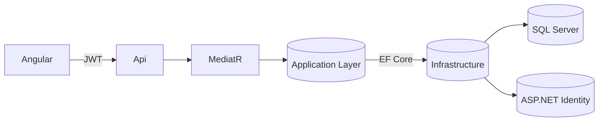

# Inspection Visits — Architecture & Patterns

## Overview
Clean Architecture with four projects:
- **Domain**: entities, enums.
- **Application**: CQRS with MediatR, FluentValidation, AutoMapper, pipeline behaviors.
- **Infrastructure**: EF Core (SQL Server), ASP.NET Identity, DbContext, DI, Seeding.
- **Api**: Minimal APIs, JWT auth, Serilog, Swagger, ProblemDetails (RFC7807).

## Design Patterns
1. **CQRS** (Commands/Queries per feature) — separates reads/writes for clarity and testability.
2. **Mediator** (via MediatR) — decouples API layer from application logic.
3. **Pipeline** (Behavior) — cross-cutting validation with FluentValidation injected as MediatR pipeline.
4. **Repository-less EF** — favoring DbContext directly in handlers (simpler for small services).
5. **Builder (JWT token)** — token is assembled via helper method.

## Diagram (Mermaid)


## Cross-cutting
- Structured logging (Serilog)
- Global exception handling -> ProblemDetails
- Validation errors -> 400 with `errors` map
- Authorization via roles (Admin/Inspector)

## Migrations
Run:
```
dotnet tool install --global dotnet-ef
dotnet ef migrations add Initial --project src/InspectionVisits.Infrastructure --startup-project src/InspectionVisits.Api --output-dir Migrations
dotnet ef database update --project src/InspectionVisits.Infrastructure --startup-project src/InspectionVisits.Api
```
